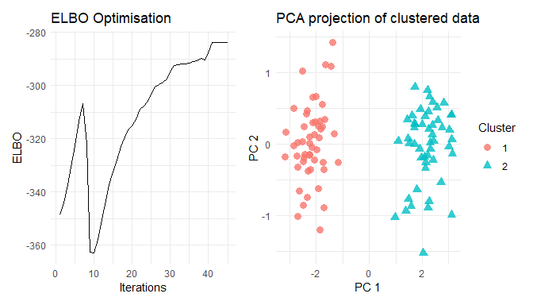

<!-- README.md is generated from README.Rmd. Please edit that file -->

# vimixr

<!-- badges: start -->

[](https://github.com/annesh07/CVI/actions/workflows/R-CMD-check.yaml)
<!-- badges: end -->

The goal of **vimixr** is to perform collapsed Variational Inference for
DPMM using adaptive inference on the DP concentration parameter as well
as covariance hyper-parameter of DP base distribution.

## Installation

You can install the development version of **vimixr** from
[GitHub](https://github.com/) with:

``` r
# install.packages("devtools")
devtools::install_github("annesh07/CVI")
```

## Example

``` r
library(vimixr)
```

Let’s generate some toy data. Here the data contains N = 100 samples, D
= 2 dimensions and K = 2 clusters.

``` r
X <- rbind(matrix(rnorm(100, m=0, sd=0.5), ncol=2),
            matrix(rnorm(100, m=3, sd=0.5), ncol=2))
```

In order to obtain the clusters present in **X**, we apply function from
**vimixr** package that corresponds to a simple case with
cluster-inspecific fixed diagonal covariance for the data.

``` r
  # Fixed-diagonal variance
  res <- cvi_npmm(X, variational_params = 20, prior_shape_alpha = 0.001,
          prior_rate_alpha = 0.001, post_shape_alpha = 0.001,
          post_rate_alpha = 0.001, prior_mean_eta = matrix(0, 1, ncol(X)),
          post_mean_eta = matrix(0.001, 20, ncol(X)),
          log_prob_matrix = t(apply(matrix(0.001, nrow(X), 20), 1,
                              function(x){x/sum(x)})), maxit = 1000,
          fixed_variance = TRUE, covariance_type = "diagonal",
          prior_precision_scalar_eta = 0.001,
          post_precision_scalar_eta = matrix(0.001, 20, 1),
          cov_data = diag(ncol(X)))
  summary(res)
#>              Length Class  Mode
#> posterior     5     -none- list
#> optimisation  2     -none- list
#> PCA_viz      11     gg     list
#> ELBO_viz     11     gg     list
  plot(res)
```


