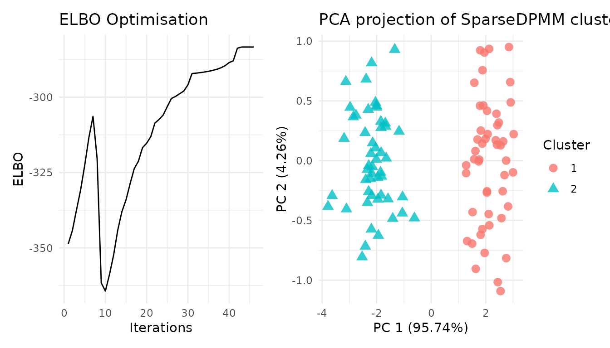
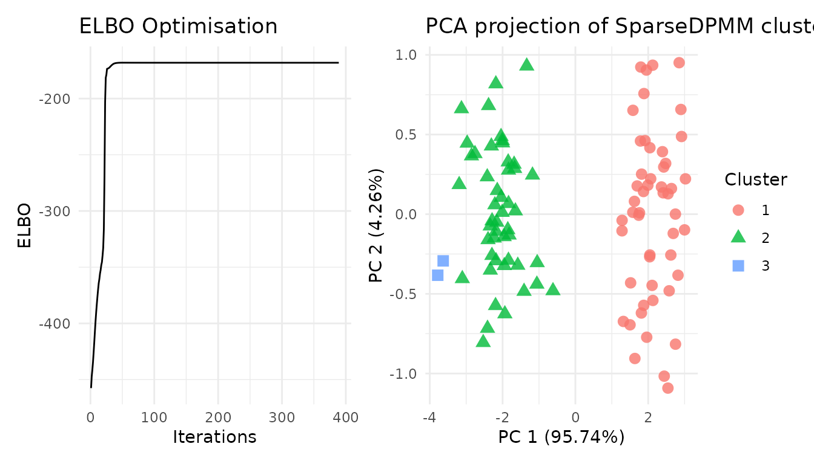
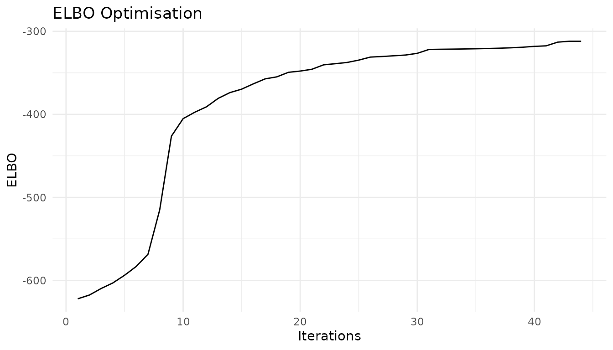
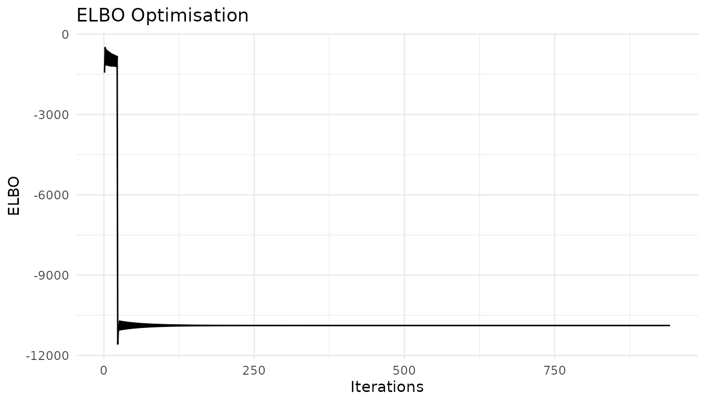
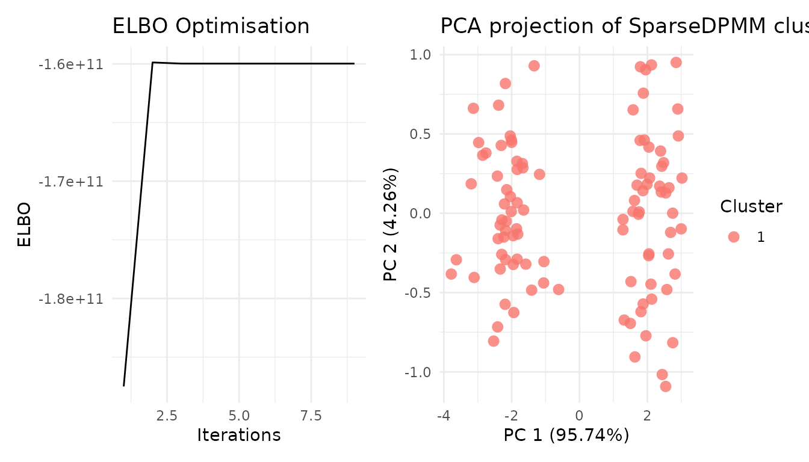
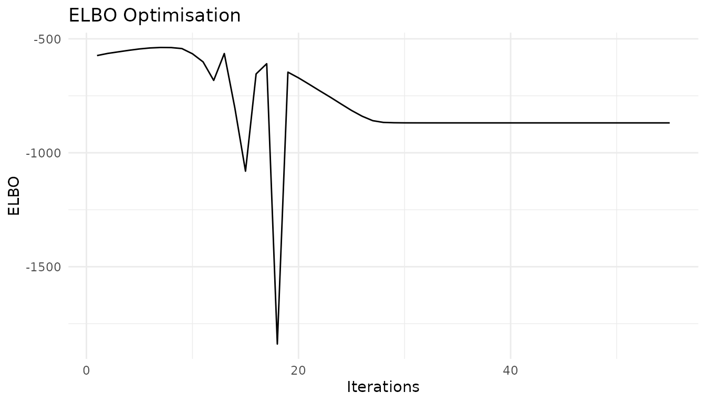
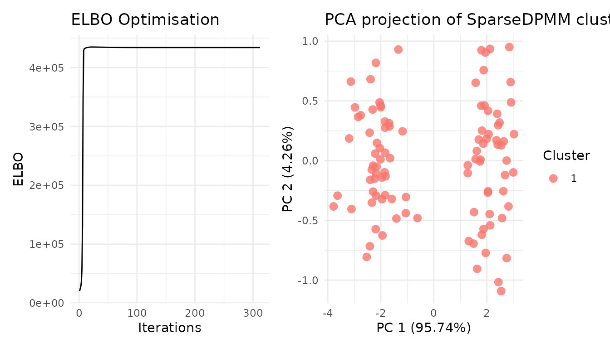
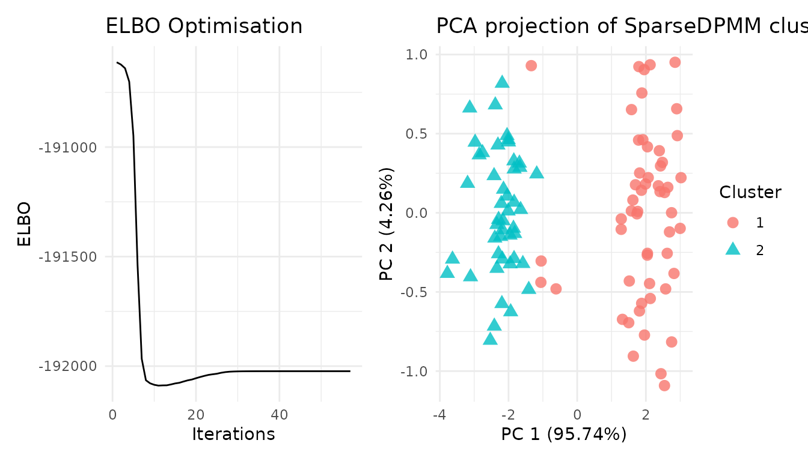

# Userguide for the \`vimixr\` package

``` r

library(vimixr)
```

Let’s generate some toy data. Here the data contains N = 100 samples, D
= 2 dimensions and K = 2 clusters.

``` r

X <- rbind(matrix(rnorm(100, m=0, sd=0.5), ncol=2),
            matrix(rnorm(100, m=3, sd=0.5), ncol=2))
```

## Fixed-diagonal variance

``` r

  res <- cvi_npmm(X, variational_params = 20, prior_shape_alpha = 0.001,
          prior_rate_alpha = 0.001, post_shape_alpha = 0.001,
          post_rate_alpha = 0.001, prior_mean_eta = matrix(0, 1, ncol(X)),
          post_mean_eta = matrix(0.001, 20, ncol(X)),
          log_prob_matrix = t(apply(matrix(0.001, nrow(X), 20), 1,
                              function(x){x/sum(x)})), maxit = 1000,
          fixed_variance = TRUE, covariance_type = "diagonal",
          prior_precision_scalar_eta = 0.001,
          post_precision_scalar_eta = matrix(0.001, 20, 1),
          cov_data = diag(ncol(X)))
  summary(res)
#>              Length Class           Mode     
#> posterior    5      -none-          list     
#> optimisation 3      -none-          list     
#> PCA_viz      1      ggplot2::ggplot object   
#> ELBO_viz     1      ggplot2::ggplot object   
#> Seed_used    1      -none-          character
  plot(res)
```



## Varied diagonal variance

``` r

 res <- cvi_npmm(X, variational_params = 20, prior_shape_alpha = 0.001,
            prior_rate_alpha = 0.001, post_shape_alpha = 0.001,
            post_rate_alpha = 0.001, prior_mean_eta = matrix(0, 1, ncol(X)),
            post_mean_eta = matrix(0.001, 20, ncol(X)),
            log_prob_matrix = t(apply(matrix(0.001, nrow(X), 20), 1,
                                      function(x){x/sum(x)})), maxit = 1000,
            covariance_type = "diagonal",fixed_variance = FALSE,
            cluster_specific_covariance = TRUE,
            variance_prior_type = "off-diagonal normal",
            prior_shape_scalar_cov = 0.001,
            prior_rate_scalar_cov = 0.001,
            post_shape_scalar_cov = 0.001,
            post_rate_scalar_cov = 0.001,
            prior_precision_scalar_eta = 0.001,
            post_precision_scalar_eta = matrix(0.001, 20, 1))
  summary(res)
#>              Length Class           Mode     
#> posterior    6      -none-          list     
#> optimisation 3      -none-          list     
#> PCA_viz      1      ggplot2::ggplot object   
#> ELBO_viz     1      ggplot2::ggplot object   
#> Seed_used    1      -none-          character
  plot(res)
```



## Fixed-full Variance

``` r

  res <- cvi_npmm(X, variational_params = 20, prior_shape_alpha = 0.001,
          prior_rate_alpha = 0.001, post_shape_alpha = 0.001,
          post_rate_alpha = 0.001, prior_mean_eta = matrix(0, 1, ncol(X)),
          post_mean_eta = matrix(0.001, 20, ncol(X)),
          log_prob_matrix = t(apply(matrix(0.001, nrow(X), 20), 1,
                                    function(x){x/sum(x)})), maxit = 1000,
          covariance_type = "full",fixed_variance = TRUE,
          cluster_specific_covariance = TRUE,
          variance_prior_type = "off-diagonal normal",
          post_cov_eta = array(rep(diag(ncol(X)), 20), c(ncol(X), ncol(X), 20)),
          prior_cov_eta = 1000*diag(ncol(X)),
          cov_data = diag(ncol(X)))
  summary(res)
#>              Length Class           Mode     
#> posterior    5      -none-          list     
#> optimisation 3      -none-          list     
#> PCA_viz      1      ggplot2::ggplot object   
#> ELBO_viz     1      ggplot2::ggplot object   
#> Seed_used    1      -none-          character
  plot(res)
```



\#Full Variance IW distribution

``` r

 res <- cvi_npmm(X, variational_params = 20, prior_shape_alpha = 0.001,
          prior_rate_alpha = 0.001, post_shape_alpha = 0.001,
          post_rate_alpha = 0.001, prior_mean_eta = matrix(0, 1, ncol(X)),
          post_mean_eta = matrix(0.001, 20, ncol(X)),
          log_prob_matrix = t(apply(matrix(0.001, nrow(X), 20), 1,
                                    function(x){x/sum(x)})), maxit = 1000,
          covariance_type = "full",fixed_variance = FALSE,
          cluster_specific_covariance = FALSE,
          variance_prior_type = "IW",
          prior_df_cov = ncol(X) + 2,
          prior_scale_cov = diag(ncol(X))*100,
          post_df_cov = ncol(X) + 2,
          post_scale_cov = diag(ncol(X)),
          post_cov_eta = array(rep(diag(ncol(X)), 20), c(ncol(X), ncol(X), 20)),
          prior_cov_eta = 1000*diag(ncol(X)))
  summary(res)
#>              Length Class           Mode     
#> posterior    6      -none-          list     
#> optimisation 3      -none-          list     
#> PCA_viz      1      ggplot2::ggplot object   
#> ELBO_viz     1      ggplot2::ggplot object   
#> Seed_used    1      -none-          character
  plot(res)
```



## Full Variance with Cholesky decomposition

``` r

  res <- cvi_npmm(X, variational_params = 20, prior_shape_alpha = 0.001,
           prior_rate_alpha = 0.001, post_shape_alpha = 0.001,
           post_rate_alpha = 0.001, prior_mean_eta = matrix(0, 1, ncol(X)),
           post_mean_eta = matrix(0.001, 20, ncol(X)),
           log_prob_matrix = t(apply(matrix(0.001, nrow(X), 20), 1,
                                     function(x){x/sum(x)})), maxit = 1000,
           covariance_type = "full",fixed_variance = FALSE,
           cluster_specific_covariance = FALSE,
           variance_prior_type = "decomposed",
           prior_shape_diag_decomp = 0.001,
           prior_rate_diag_decomp = 0.001,
           prior_mean_offdiag_decomp = 0,
           prior_var_offdiag_decomp = 1,
           post_shape_diag_decomp = matrix(0.001, 1, ncol(X)),
           post_rate_diag_decomp = matrix(0.001, 1, ncol(X)),
           post_mean_offdiag_decomp = matrix(0, 1, 0.5*ncol(X)*(ncol(X)-1)),
           post_var_offdiag_decomp = matrix(0.001, 1, 0.5*ncol(X)*(ncol(X)-1)),
           post_cov_eta = array(rep(diag(ncol(X)), 20), c(ncol(X), ncol(X), 20)),
           prior_cov_eta = 1000*diag(ncol(X)))
  summary(res)
#>              Length Class           Mode     
#> posterior    6      -none-          list     
#> optimisation 3      -none-          list     
#> PCA_viz      1      ggplot2::ggplot object   
#> ELBO_viz     1      ggplot2::ggplot object   
#> Seed_used    1      -none-          character
  plot(res)
```



## Cluster-specific diagonal with IW distribution

``` r

 res <- cvi_npmm(X, variational_params = 20, prior_shape_alpha = 0.001,
           prior_rate_alpha = 0.001, post_shape_alpha = 0.001,
           post_rate_alpha = 0.001, prior_mean_eta = matrix(0, 1, ncol(X)),
           post_mean_eta = matrix(0.001, 20, ncol(X)),
           log_prob_matrix = t(apply(matrix(0.001, nrow(X), 20), 1,
                                     function(x){x/sum(x)})), maxit = 1000,
           covariance_type = "full",fixed_variance = FALSE,
           cluster_specific_covariance = TRUE,
           variance_prior_type = "IW",
           prior_df_cs_cov = ncol(X) + 2,
           prior_scale_cs_cov = diag(ncol(X)),
           post_df_cs_cov = matrix(rep(ncol(X) + 2, 20), nrow = 1),
           post_scale_cs_cov = array(rep(diag(ncol(X)), 20), c(ncol(X), ncol(X), 20)),
           scaling_cov_eta = nrow(X))
  summary(res)
#>              Length Class           Mode     
#> posterior    6      -none-          list     
#> optimisation 3      -none-          list     
#> PCA_viz      1      ggplot2::ggplot object   
#> ELBO_viz     1      ggplot2::ggplot object   
#> Seed_used    1      -none-          character
  plot(res)
```



## Cluster-specific sparse Variance

``` r

 res <- cvi_npmm(X, variational_params = 20, prior_shape_alpha = 0.001,
           prior_rate_alpha = 0.001, post_shape_alpha = 0.001,
           post_rate_alpha = 0.001, prior_mean_eta = matrix(0, 1, ncol(X)),
           post_mean_eta = matrix(0.001, 20, ncol(X)),
           log_prob_matrix = t(apply(matrix(0.001, nrow(X), 20), 1,
                                     function(x){x/sum(x)})), maxit = 1000,
           covariance_type="full",fixed_variance=FALSE,
           cluster_specific_covariance = TRUE,
           variance_prior_type = "sparse",
           prior_shape_d_cs_cov = matrix(rep(100, 20), nrow = 1, ncol = 20),
           prior_rate_d_cs_cov = matrix(rep(100, 20*ncol(X)), 20, ncol(X)),
           prior_var_offd_cs_cov = 1000,
           post_shape_d_cs_cov = matrix(0.001, 1, 20),
           post_rate_d_cs_cov = matrix(0.001, 20, ncol(X)),
           post_var_offd_cs_cov = array(0.001, c(ncol(X), ncol(X), 20)),
           scaling_cov_eta = nrow(X))
  summary(res)
#>              Length Class           Mode     
#> posterior    8      -none-          list     
#> optimisation 3      -none-          list     
#> PCA_viz      1      ggplot2::ggplot object   
#> ELBO_viz     1      ggplot2::ggplot object   
#> Seed_used    1      -none-          character
  plot(res)
```



## Cluster-specific variance with off-diagonal normal priors

``` r

 res <- cvi_npmm(X, variational_params = 20, prior_shape_alpha = 0.001,
           prior_rate_alpha = 0.001, post_shape_alpha = 0.001,
           post_rate_alpha = 0.001, prior_mean_eta = matrix(0, 1, ncol(X)),
           post_mean_eta = matrix(0.001, 20, ncol(X)),
           log_prob_matrix = t(apply(matrix(0.001, nrow(X), 20), 1,
                                     function(x){x/sum(x)})), maxit = 1000,
           covariance_type="full",fixed_variance=FALSE,
           cluster_specific_covariance = TRUE,
           variance_prior_type = "off-diagonal normal",
           prior_shape_d_cs_cov = matrix(rep(100, 20), nrow = 1, ncol = 20),
           prior_rate_d_cs_cov = 100,
           prior_var_offd_cs_cov = 0.0001,
           post_shape_d_cs_cov = matrix(0.001, 1, 20),
           post_rate_d_cs_cov = matrix(0.001, 20, ncol(X)),
           post_mean_offd_cs_cov = array(rep(diag(ncol(X)), 20), c(ncol(X), ncol(X), 20)),
           scaling_cov_eta = nrow(X))
  summary(res)
#>              Length Class           Mode     
#> posterior    6      -none-          list     
#> optimisation 3      -none-          list     
#> PCA_viz      1      ggplot2::ggplot object   
#> ELBO_viz     1      ggplot2::ggplot object   
#> Seed_used    1      -none-          character
  plot(res)
```


